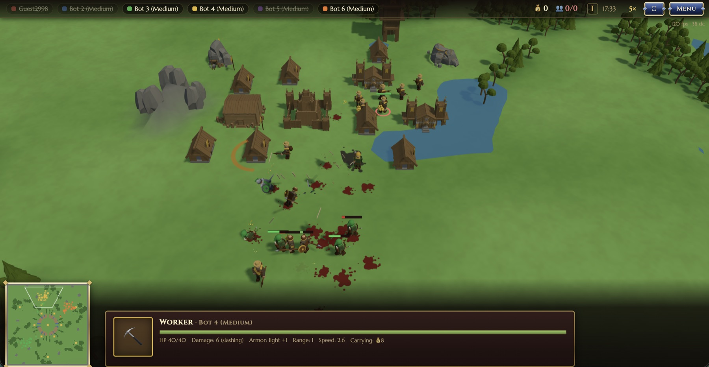

# Rookfall — a browser RTS

A real-time strategy game in the classic mold: low-poly 3D, workers and gold, barracks, catapults,
two ages and a castle to besiege. Skirmish against bots runs entirely in the browser — no server,
no internet. To play with people there are invite-link rooms and ranked 1v1.



## Modes

|  |  |
|---|---|
| ⚔️ **Vs AI** | skirmish for up to 6 players, three bot difficulties, 7 maps (random one included), match speed 1×–5× |
| 🌐 **Multiplayer** | room by code or invite link, public or private, chat, bots in free slots |
| 🏆 **Ranked** | 1v1 on a symmetric random map, Glicko-2 from 1500; if no opponent turns up in 3 minutes you get a practice match against a bot |
| 🎞️ **Replays** | every match is recorded and can be replayed with seeking |

## Rules in short

Win by destroying every enemy castle. You start with a castle, 4 workers and 300 gold.

**Economy.** Workers mine gold from veins and carry it back to the castle — a loaded worker walks
30 % slower. They also build and repair, and with no orders they find work on their own. A mine
gives passive income: up to three workers inside, no walking, out of harm's way.

**Building.** House (+5 population), barracks, forge (upgrades), watchtower, fence and mine.
Every building has three construction stages, so it visibly grows — and a hit on the site knocks
its progress back.

**The triangle.** Soldiers cut down archers and cavalry, archers and cavalry punch through
catapults, catapults tear apart buildings and heavy infantry. Each branch has its own ability —
shield stance, volley, incendiary shot; the castle calls up three free militia every 2 minutes.

**The second age** (500 gold, needs a forge) turns every building to stone and toughens it, unlocks
the catapult and cavalry, and opens the higher upgrade levels.

## Controls

|  |  |
|---|---|
| LMB, drag box | select; Shift adds to the selection |
| RMB | smart order: move, attack, gather, enter a mine or tower |
| Hold RMB or middle button | pan the camera; wheel zooms, `Q`/`E` rotate, `WASD` and arrows scroll |
| `A` `S` `H` `P` | attack-move, stop, hold position, patrol |
| `B` | build menu: `C` castle, `H` house, `B` barracks, `F` forge, `T` tower, `L` fence, `M` mine |
| `W` `S` `R` `V` `C` | train worker, soldier, archer, cavalry, catapult |
| `D` `X` `I` | ability, dismantle a building, advance to the second age |
| `F1` `F2` | select the whole army / next idle worker |
| ⛶ | fullscreen |
| Touch | one finger is LMB, two are RMB: tap selects (bare ground drops the selection), a two-finger tap gives the order, holding both queues it · drag moves the camera, hold then drag draws a box · pinch zooms about the fingers (on a phone, close enough to tap one unit), twist rotates |

Hotkeys are bound to the physical key, so on a Russian layout "Ф" still means `A`. All of them are
rebindable in the settings.

## Running it locally

Node 20+ and pnpm.

```bash
pnpm install
pnpm assets   # build the 3D models into public/models — once after cloning
pnpm dev      # server :8080 + client :5173, open http://localhost:5173
```

One command brings up everything: Vite proxies `/ws` and `/api` to the game server. A skirmish
against bots needs no server at all, but the same process hosts lobbies, ranked and replays.

Production build — `pnpm build && pnpm start`: a single Node process serves the client, the API and
the WebSocket on :8080. Server settings: `PORT` (8080), `DATA_DIR` (`./data` — replays and ratings),
`GIT_SHA` (build version, reported by `/api/health`).

## Further reading

- [docs/DESIGN.md](docs/DESIGN.md) — how it works inside: deterministic lockstep, the package layout, every gameplay decision and the repo's commands (in Russian).
- [DEPLOY.md](DEPLOY.md) — deployment: Docker, nginx, ports, updates and rollback (in Russian).
- [PRD.md](PRD.md) — the original spec (in Russian).

Building models come from the [Quaternius Ultimate Fantasy RTS](https://quaternius.com) pack (CC0);
the units are built by our own Blender scripts.
